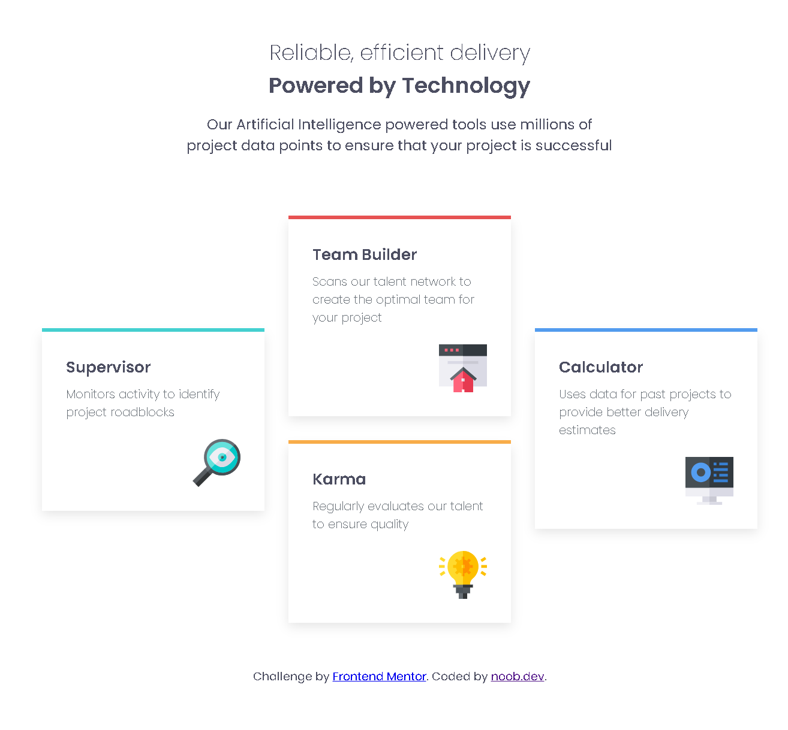

# Four Card Feature Section

A responsive **four-card feature section** built using **HTML, CSS, and CSS Grid**, inspired by the [Frontend Mentor challenge](https://www.frontendmentor.io?ref=challenge). This project demonstrates **modern layout techniques** including Flexbox (for mobile) and CSS Grid (for desktop), semantic HTML, and responsive design.

---

## 🔹 Demo



---

## 🔹 Features

* Fully **responsive**: mobile-first layout that transitions into a diamond-style grid on larger screens.
* **CSS Grid** used for desktop layout to map cards precisely.
* **Flexbox** used for vertical stacking on smaller screens.
* Clean and **semantic HTML structure**.
* **Custom CSS variables** for colors and consistent styling.
* Smooth **box-shadow** and card design.

---

## 🔹 Technologies

* HTML5
* CSS3
* Google Fonts: [Poppins](https://fonts.google.com/specimen/Poppins)

---

## 🔹 Installation

1. Clone the repository:

```bash
git clone https://github.com/noobdev08/four-card-feature-section.git
```

2. Open `index.html` in your browser.

---

## 🔹 Usage

* Perfect for a **landing page feature section**.
* Can be customized by changing colors, card content, or images.
* Fully responsive for desktop and mobile.

---

## 🔹 Author

**noobdev08** – available on all platforms.
[GitHub](https://github.com/noobdev08) | [Frontend Mentor](https://www.frontendmentor.io/profile/noobdev08)